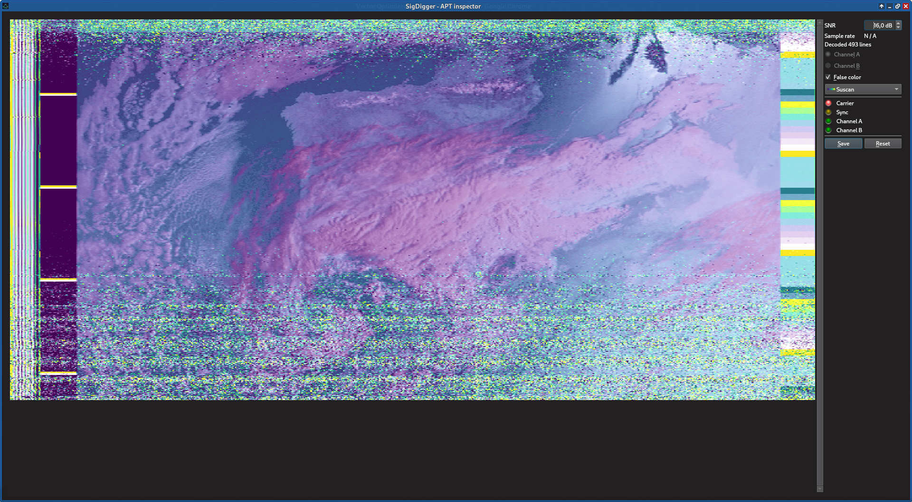
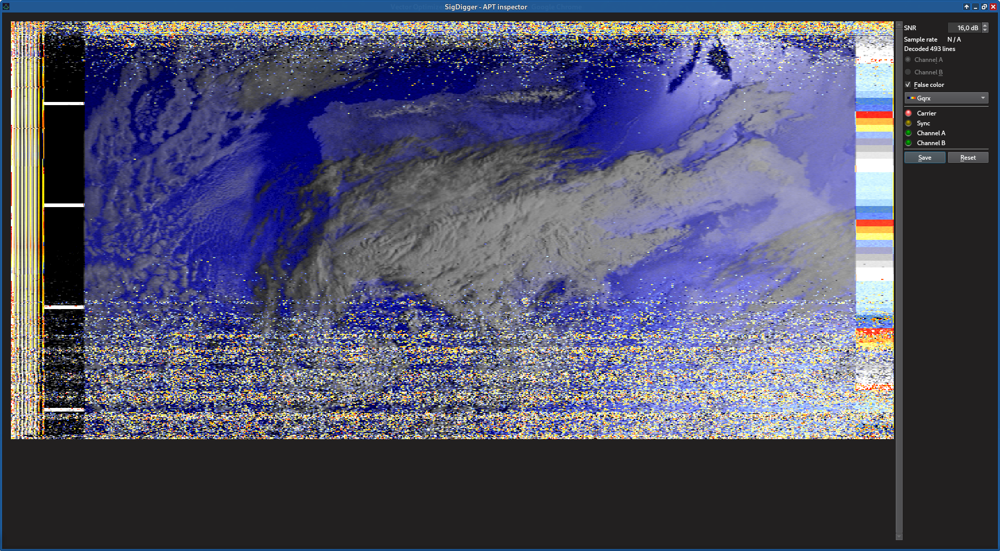
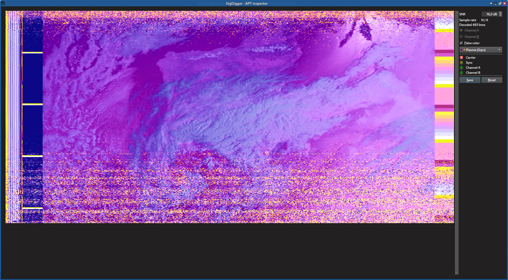
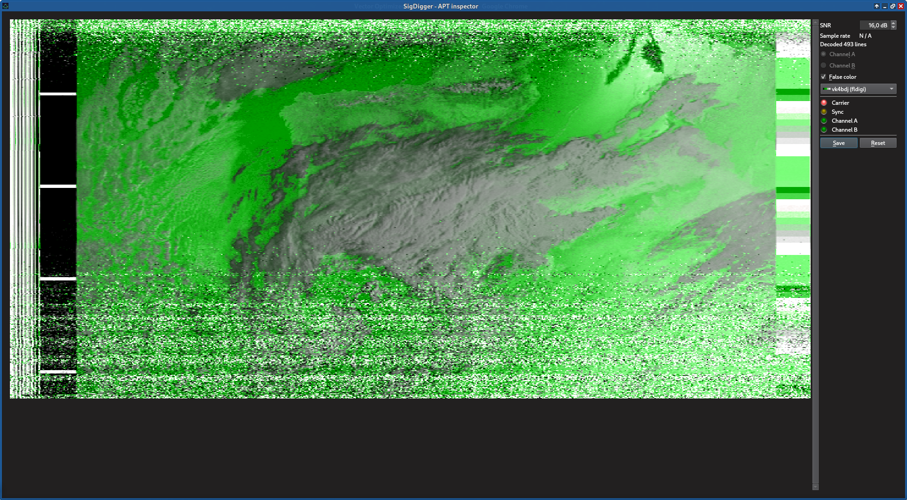
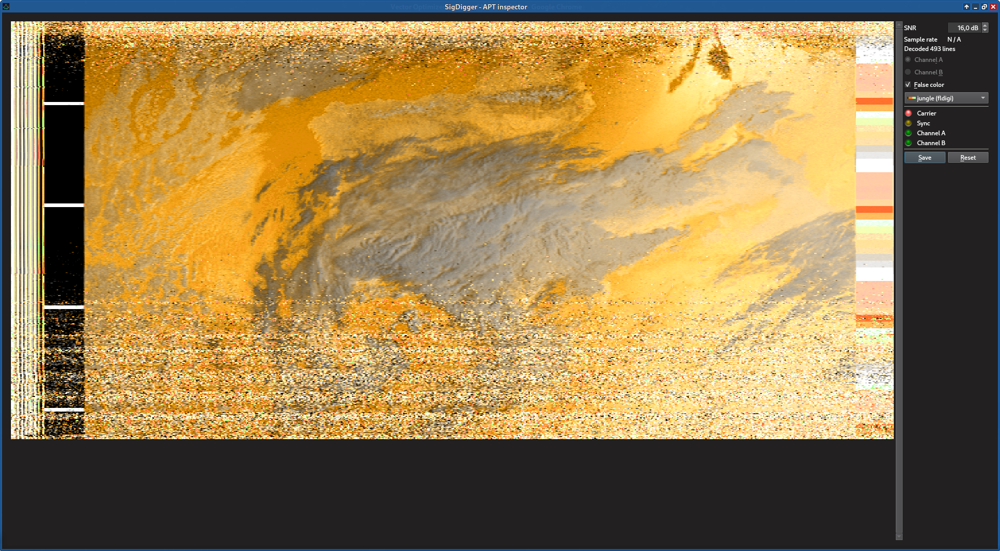
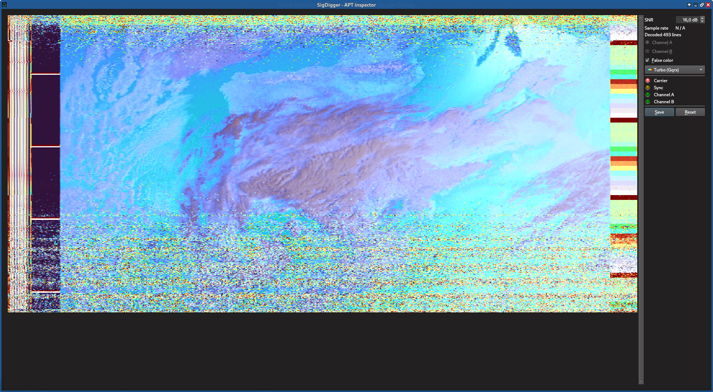

# APTPlugin
**APTPlugin** is a demonstrator plugin for the new SigDigger's plugin support. It enables APT decoding as a new inspector widget, under the following demodulators:

* **Audio demodulator**: in which the channel is treated as a regular audio channel, and the audio FM demodulator is switched on (**this is the recomended configuration**)
* **Digital FM demodulator (FSK)**: which relies on the classic FSK demodulator provided by Suscan (this one is usually faster, but it also lets in more noise)
* **Digital AM demodulator (ASK)**: which treats the signal as the AM subcarrier of the FM channel.

## Demo
[](https://www.youtube.com/watch?v=-GAIBVEWOts)

## Palette support
APTPlugin uses the spectrum palettes to colorize the decoded map. This is what some of the available palettes look like over the same map:




## Installing this plugin, in 3 easy steps
**Step 1: generate makefiles**

Make sure that sigutils, suscan, SuWidgets and SigDigger have been installed in a system-wide location with `sudo make install`
```
$ cd APTPlugin
$ qmake APTPlugin.pro
```

**Step 2: build**
```
$ make
```

**Step 3: install**
```
$ mkdir -p ~/.suscan/plugins
$ cp libAPTPlugin.so.1.0.0 ~/.suscan/plugins
```
And that's it! :D
